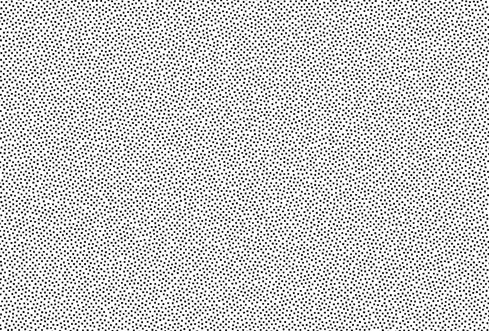

# 随机纹理生成

> 生成随机无序点阵，适用于光学仿真与纹理设计

## 什么是随机纹理生成？

一款在线工具，能够基于晶格算法生成各类随机分布的无序点阵，满足科研与设计需求。

## 核心功能

- **晶格算法** — 基于先进晶格算法，生成高质量随机无序点阵
- **参数可调**
  - 点数量
  - 区域大小
  - 最小间距
  - 分布参数

- **导出格式**
  - DXF 文件（CAD 兼容）

## 效果展示

## 适用场景

- 光学散斑仿真
- 随机介质建模
- Monte Carlo 模拟
- 纹理图案设计
- 粒子系统背景

## 联系购买

- **微信公众号：** 光研笔记
- **邮箱：** （待补充）

---

> 🎲 敬请期待，功能陆续开放中...